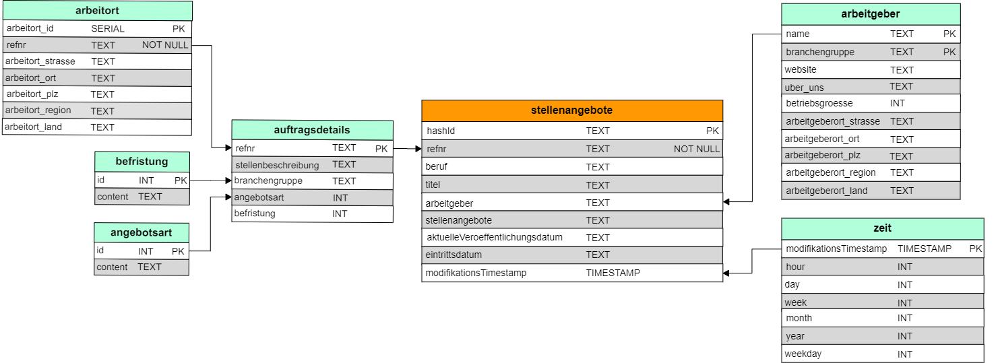

# Project summary
## Introduction
As a Data Engineer at Stepstone within the "Commercial Office Analytics" department you will have to extract data from
different sources (both internal and external) as well as properly cleanse and load the retrieved data.

The project is finding out more about the German job market and filling the gaps on Stepstone platform. In particular,
we need retrieve all **full-time "Data Engineer"** Positions listed on the website of Germany's job agency 
(www.arbeitsagentur.de) and load them into Stepstone Database.

## Description
The project includes creating and connecting to Stepstone Database (`connect_db.py` and `db.cfg`), collecting data by 
utilizing jobsuche-api and storing them in JSON files (`collecting_data.py`), creating required tables 
(`create_tables.py`), extracting, transforming, and loading data into Stepstone Database (`etl.py` or `etl_spark.py`).

## Database in Snowflake schema


# How to run
## Step 1: Clarify Stepstone Database and JAR file path for JDBC driver configuration
```buildoutcfg
[stepstone]
host = 
dbname = 
user = 
password = 

[postgresql_default]
host = localhost
dbname = postgres
user = postgres
password = 

[spark_config]
postgres_jar = 
```

## Step 2: Build image with Dockerfile
Build image from Dockerfile
```commandline
docker build -t stepstone .
```

Run container in attach mode
```commandline
docker run stepstone
```

**OR** Run the following lines on your machine with below oder 
```commandline
python collecting_data.py
python create_tables.py

python etl.py 
or 
python etl_spark.py
```
